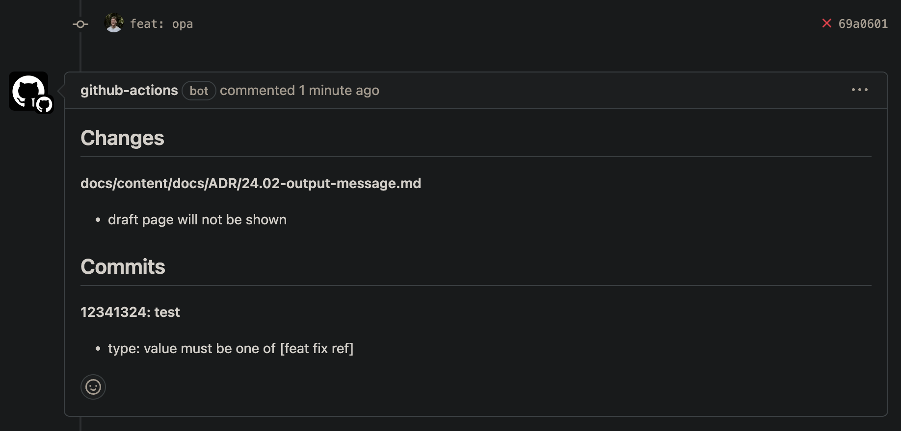

# changes-action
GitHub action to run [changes check](https://rusinikita.github.io/changes/) for git style and diff validation.

```yaml

steps:
  - uses: rusinikita/changes-action@v1
```



Action combines install script and other actions for fastest execution:
- Binary installation script
- Caching binary to skip installation in next runs
- Running `check` command
- Posting `check` result message in pull request

#### Full workflow

Create `.github/wokrflows/changes.yml` file and fill it with following content.

```yaml

name: changes verification
on:
  pull_request:

permissions:
  contents: read
  pull-requests: write # important for message posting, removable

jobs:
  lint:
    name: changes-verification
    runs-on: ubuntu-latest
    steps:
      - uses: actions/checkout@v4
        with:
          # skip pull request merge commit, important if "no merge commits" validation enabled, removable
          ref: ${{ github.event.pull_request.head.sha }}
          # fetch all branches and commits, important for git diff retrieving
          fetch-depth: 0
      - uses: rusinikita/changes-action@v1
        with:
          version: v0.3.2 # version of changes cli, default latest   
          pr-message: true # enables message posting, default false
          config: .changes.yaml # config file path, default is .changes.[yaml,yml,toml,json]
```

> [!NOTE]
> Using `latest` version slows action run a little.
> It enables network request for resolving latest release.
> Resolved version binary cashed until new release detected.
